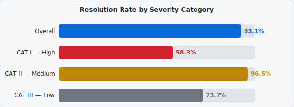

# Automated DISA STIG Hardening Pipeline
Automated security compliance pipeline reducing RHEL 9 DISA STIG implementation from 40+ hours to <30 minutes while improving compliance from 48% to 96%. Delivers repeatable, auditable hardening across enterprise Linux fleets with formal exception tracking.

## At a Glance
| Compliance Improvement   | Progress                                  |
|:-------------:           |:--------------:                           |
| Baseline Report          |  |
| Post-Hardening Report    |  |

**Security Posture**

- ✅ CAT I: 12 → 5 (58% resolved)

- ✅ CAT II: 228 → 8 (96% resolved)

- ✅ CAT III: 19 → 5 (74% resolved)

## Overview
This project demonstrates automated security compliance for Department of Defense (DoD) and federal IT systems. It takes a fresh RHEL 9 installation from 48.64% DISA STIG compliance to 96.12% compliance in under 30 minutes using:

- OpenSCAP for security scanning against official DISA STIGs

- Ansible for automated remediation
  
- Infrastructure as Code principles for repeatability

**The Problem ❌**

Manual STIG implementation on Linux systems:
- Takes 40+ hours per server
  
- Prone to human error

- Requires extensive documentation

- Difficult to maintain consistency across fleets

**The Solution ✅**

An automated pipeline that:

1. Scans the system against 727 DISA STIG controls
2. Generates Ansible remediation playbooks automatically
3. Applies hardening configurations idempotently
4. Validates compliance with post-remediation scans
5. Documents exceptions with risk assessments

## Architecture

## Workflow

## Project Files

### Configuration Files

The automation configurations are available in the [`configs/`](configs/) directory:
- **[`ansible.cfg`](configs/ansible.cfg)** - Ansible configuration with inventory path, SSH settings
- **[`lab.ini`](configs/lab.ini)** - Inventory file defining target hosts and connection parameters

### Playbooks

The automation playbooks are in the [`playbooks/`](playbooks/) directory:
- **[`full-pipeline.yml`](playbooks/full-pipeline.yml)** - Master orchestration playbook running all three phases:
  - Phase 1: Baseline STIG scan
  - Phase 2: Automated remediation
  - Phase 3: Post-remediation verification

- **[`rhel9-stig-remediation.yml`](playbooks/rhel9-stig-remediation.yml)** - OpenSCAP auto-generated remediation tasks with 300+ security controls. **(Select "View raw" to see the full file)**

## Security Hardening
| Authentication & Access Control                               | Audit & Logging                                  | System Protection                                |
| :-------------                                                |:--------------                                   |:--------------                                   |
| 15+ character passwords with complexity requirements          | auditd enabled with privileged command tracking  | SELinux enforcing mode                           |
| 24-password history enforcement                               | Immutable audit logs                             | Firewalld with minimal allowed services          |
| Account lockout after 3 failed attempts                       | File integrity monitoring (AIDE)                 | Kernel hardening (ASLR, NX bit, exec-shield)     |
| SSH hardening (key-only auth, no root login, idle timeout)    | Centralized syslog configuration                 | Unnecessary services disabled                    |

## Automation Capabilities

- **Idempotent** - Safe to run multiple times

- **Scalable** - Add hundreds of hosts to inventory

- **Auditable** - XML/HTML evidence packages

- **Documented** - Auto-generates exception reports

## Reporting

- HTML reports with visual compliance dashboards

- XML results for SIEM integration

- Before/after comparison metrics

- CAT I/II/III severity categorization

## Results & Analysis Compliance Improvement
| Metric                    | Baseline                                  | Post-Hardening                             | Change          |
| :-------------            | :--------------:                          | :--------------:                           |:--------------: |                        
| **Overall Compliance**    |  |   | +47.48% ✅      |
| Rules Passed              | 174                                       | 420                                        | +246            |
| Rules Failed              | 262                                       | 18                                         | -244            |
| Total Rules               | 727                                       | 727                                        | -               |

> **Baseline Report:** https://davperez-tech.github.io/Automated-DISA-STIG-Hardening-Pipeline/Reports/rhel9-stig-baseline-report.html

> **Post-Hardening Report:** https://davperez-tech.github.io/Automated-DISA-STIG-Hardening-Pipeline/Reports/post-hardening-report.html

**Resolution Rate by Category**

## What Changed?
**Top Security Improvements:**

✅ Audit Subsystem - Full auditd configuration with privileged command tracking

✅ Password Policies - Complexity, history, and lockout enforcement

✅ SSH Hardening - Disabled root login, key-only auth, idle timeout

✅ File Permissions - Corrected 200+ critical system files

✅ SELinux - Enabled and set to enforcing mode

✅ Firewall - Active with minimal allowed services

✅ Service Hardening - Disabled 15+ unnecessary services

## Exception & Unresolved Findings
This report documents all unresolved DISA Security Technical Implementation Guide (STIG) findings identified 
following automated remediation of a Red Hat Enterprise Linux 9 system. The findings documented herein 
represent exceptions requiring organizational risk acceptance, site-specific configuration, or infrastructure-level 
prerequisites that cannot be addressed through automated scripting alone. 

> **Exception & Unresolved Findings Report:** [Reports](Reports/Exception&UnresolvedFindingsReport.pdf)

## POA&M Document
Formal Plan of Action & Milestones document tracking the 18 unresolved DISA STIG findings remaining after automated remediation brought your RHEL 9 system from 48.64% to 96.12% compliance.

> **POA&M:** [Document](Reports/POA&MReport.pdf)

## Compliance Framework and Mapping
This implementation satisfies controls across multiple frameworks:

| **NIST SP 800-53 Rev5**            | NIST SP 800-171                                              |
| :-------------                     | :--------------                                              |                        
| AC-2 Account Management            | 3.1.x Access Control (14 requirements)                       |
| AC-7 Unsuccessful Login Attempts   | 3.3.x Audit & Accountability (9 requirements)                |
| AU-2 Audit Events                  | 3.4.x Configuration Management (9 requirements)              |
| AU-12 Audit Generation             | 3.5.x Identification & Authentication (11 requirements)      |
| CM-6 Configuration Settings        | 3.13.x System & Communications Protection (16 requirements)  |
| IA-5 Authenticator Management      | -                                                            |
| SC-7 Boundary Protection           | -                                                            |
| SI-2 Flaw Remediation              | -                                                            |

### CMMC Level 2

- Demonstrates implementation of 110+ practices required for DoD contractors handling Controlled Unclassified Information (CUI).

- Relevant domains: Access Control (AC), Audit & Accountability (AU), Configuration Management (CM), Identification & Authentication (IA), System & Communications Protection (SC)

## Conclusion

This project demonstrates that security compliance doesn't have to be a manual, time-consuming burden. By combining OpenSCAP scanning with Ansible automation, we've transformed a 40-hour manual process into a 30-minute automated pipeline that consistently delivers 96%+ DISA STIG compliance across RHEL 9 systems.

**Key Takeaways:**
- **Efficiency:** 95% reduction in hardening time per system
- **Consistency:** Identical configuration across entire server fleet
- **Auditability:** Automated evidence generation for compliance reviews
- **Scalability:** Single playbook manages unlimited target hosts

The 18 remaining unresolved findings represent organizational policy decisions and infrastructure prerequisites that appropriately require human judgment not technical limitations of the automation.

For organizations managing DoD contracts, federal systems, or any environment requiring NIST 800-53/800-171 compliance, this approach provides a foundation for repeatable, auditable security posture management at scale.
